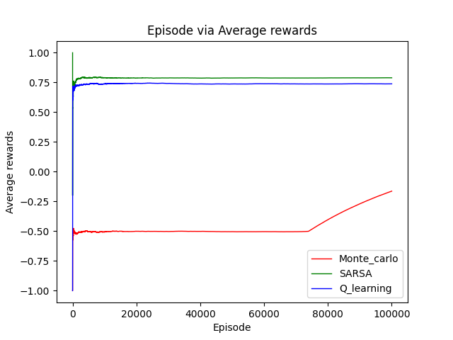
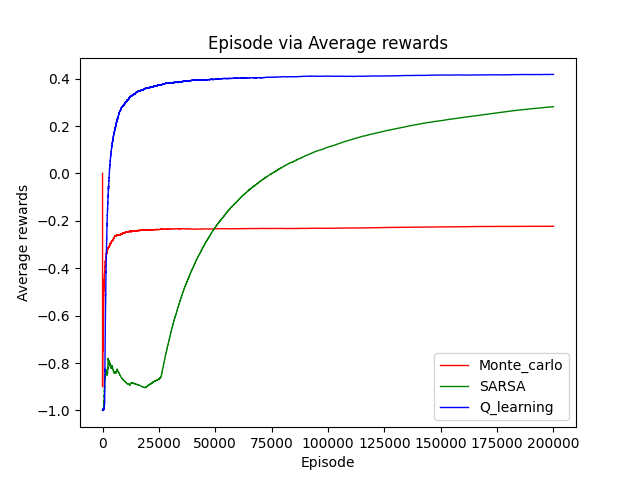

# ME5406 Project1
This is a repository which contains simple implementations for ME5406 Deep learning for robotics 

## Problem description
Consider a RL based robot is in a grid frozen lake environment, where the goal of the robot is to pick up the target while avoid falling into the ice holes

## RL algorithm
1. First visit monte carlo
2. SARSA
3. Q-learning

## Requirements
* numpy
* matplotlib
* tkinter
* PIL
* Pandas

## Usage
### Train
Need to define the RL agent type ('mc'/'sarsa'/'ql') in the main funtion, and change the grid world size , the number of training epochs in the Parameter.py

For example, if you want to train q-learning with 4x4 grid world with 10000 epochs, then you could set the corresponding parameters in the Parameter.py and comment out the commands used for training in the main function and use
```
python main.py
```

### Test
Need to define the test type, which can be described as below
* t1: Frozen lake environment training, correctness test, and comparison test among three algorithms
* t2, Frozen lake environment training, correctness test, and comparison test among Q learning and Sarsa
* 23, comparison test for different learning rate value settings
* t4, comparison test for different gamma value settings
* t5, comparison test for different epsilon value settings

If you want to test with t1, you could comment out the commands used for training in the main function and use
```
python main.py 
```

### Some Training Results
* First visit Monte Carlo
  * 4x4 grid world
   
    
  * 10x10 grid world
  
    
* SARSA
  * 4x4 grid world
    
  * 10x10 grid world
    
* Q-learning
  * 4x4 grid world
    
  * 10x10 grid world
    
    
* Final policy
  * 4x4 grid world
    From left to right: Monte Carlo, SARSA, Q-learning
    
    
  * 10x10 grid world
    From left to right: Monte Carlo, SARSA, Q-learning
    
    
### Some Testing Results
* Algorithm comparisons
    * 4x4 grid world
    
      
    * 10x10 grid world
    
      
      
* Learning rate
  Red/0.01, Green/0.001, Blue/0.0001
  
* Gamma
  Red/0.8, Green/0.9, Blue/0.99
  
* Epsilon
  Red/0.7, Green/0.8, Blue/0.9

